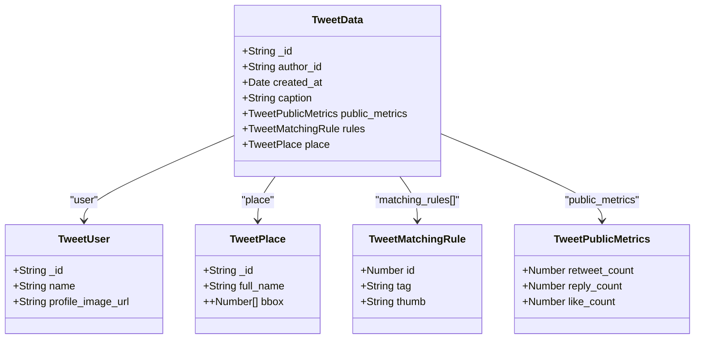

```mermaid
classDiagram
    class TweetData {
        +String _id
        +String author_id
        +Date created_at
        +String caption
        +TweetPublicMetrics public_metrics
        +TweetMatchingRule rules
        +TweetPlace place
    }

    class TweetPublicMetrics {
        +Number retweet_count
        +Number reply_count
        +Number like_count
    }

    class TweetUser {
        +String _id
        +String name
        +String profile_image_url
    }

    class TweetPlace {
        +String _id
        +String full_name
        ++Number[] bbox
    }

    class TweetMatchingRule {
        +Number id
        +String tag
        +String thumb
    }

    TweetData --> TweetUser : "user"
    TweetData --> TweetPlace : "place"
    TweetData --> TweetMatchingRule : "matching_rules[]"
    TweetData --> TweetPublicMetrics : "public_metrics"
```
